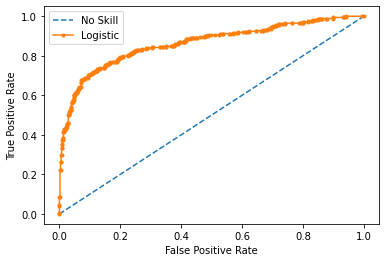

# Kaggle Titanic Knowledge Challenge

## By Matthew Tonks

This is a project to showcase my skills in Data Analysis and walk the reader through my thought process. I will be using python

This challege is to accurately distinguish between Passengers and find patterns in how to identify if they survived or not through this disaster. There is a training and testing files to rank teams with the testing file.

### Imports and reading the data from Kaggle

I have used each of these before in similar classification assignments 


```python
import pandas as pd
import numpy as np
import matplotlib.pyplot as plt
from sklearn.cluster import KMeans
from sklearn.preprocessing import StandardScaler
from sklearn.metrics import silhouette_score
import statsmodels.api as sm
from sklearn.model_selection import train_test_split
from sklearn.ensemble import RandomForestRegressor
from sklearn import tree
from sklearn.tree import export_graphviz


train = pd.read_csv("train.csv")
train.head()
```


<div>
<style scoped>
    .dataframe tbody tr th:only-of-type {
        vertical-align: middle;
    }

    .dataframe tbody tr th {
        vertical-align: top;
    }

    .dataframe thead th {
        text-align: right;
    }
</style>
<table border="1" class="dataframe">
  <thead>
    <tr style="text-align: right;">
      <th></th>
      <th>PassengerId</th>
      <th>Survived</th>
      <th>Pclass</th>
      <th>Name</th>
      <th>Sex</th>
      <th>Age</th>
      <th>SibSp</th>
      <th>Parch</th>
      <th>Ticket</th>
      <th>Fare</th>
      <th>Cabin</th>
      <th>Embarked</th>
    </tr>
  </thead>
  <tbody>
    <tr>
      <th>0</th>
      <td>1</td>
      <td>0</td>
      <td>3</td>
      <td>Braund, Mr. Owen Harris</td>
      <td>male</td>
      <td>22.0</td>
      <td>1</td>
      <td>0</td>
      <td>A/5 21171</td>
      <td>7.2500</td>
      <td>NaN</td>
      <td>S</td>
    </tr>
    <tr>
      <th>1</th>
      <td>2</td>
      <td>1</td>
      <td>1</td>
      <td>Cumings, Mrs. John Bradley (Florence Briggs Th...</td>
      <td>female</td>
      <td>38.0</td>
      <td>1</td>
      <td>0</td>
      <td>PC 17599</td>
      <td>71.2833</td>
      <td>C85</td>
      <td>C</td>
    </tr>
    <tr>
      <th>2</th>
      <td>3</td>
      <td>1</td>
      <td>3</td>
      <td>Heikkinen, Miss. Laina</td>
      <td>female</td>
      <td>26.0</td>
      <td>0</td>
      <td>0</td>
      <td>STON/O2. 3101282</td>
      <td>7.9250</td>
      <td>NaN</td>
      <td>S</td>
    </tr>
    <tr>
      <th>3</th>
      <td>4</td>
      <td>1</td>
      <td>1</td>
      <td>Futrelle, Mrs. Jacques Heath (Lily May Peel)</td>
      <td>female</td>
      <td>35.0</td>
      <td>1</td>
      <td>0</td>
      <td>113803</td>
      <td>53.1000</td>
      <td>C123</td>
      <td>S</td>
    </tr>
    <tr>
      <th>4</th>
      <td>5</td>
      <td>0</td>
      <td>3</td>
      <td>Allen, Mr. William Henry</td>
      <td>male</td>
      <td>35.0</td>
      <td>0</td>
      <td>0</td>
      <td>373450</td>
      <td>8.0500</td>
      <td>NaN</td>
      <td>S</td>
    </tr>
  </tbody>
</table>
</div>


### Start of Data Cleaning and adding Features

I had to be careful and use pandas tools to parse character data into new usable numerical data for python to use.


```python
t = pd.get_dummies(data=train, columns = ['Pclass','Sex','Embarked'])
```


```python
t['FamilySize'] = t['SibSp'] + t['Parch']
t['FareperPerson'] = t['Fare']/ (t['FamilySize']+1)
t = t.drop(columns = ['Name','Ticket'])
t.head()
```


<div>
<style scoped>
    .dataframe tbody tr th:only-of-type {
        vertical-align: middle;
    }

    .dataframe tbody tr th {
        vertical-align: top;
    }

    .dataframe thead th {
        text-align: right;
    }
</style>
<table border="1" class="dataframe">
  <thead>
    <tr style="text-align: right;">
      <th></th>
      <th>PassengerId</th>
      <th>Survived</th>
      <th>Age</th>
      <th>SibSp</th>
      <th>Parch</th>
      <th>Fare</th>
      <th>Cabin</th>
      <th>Pclass_1</th>
      <th>Pclass_2</th>
      <th>Pclass_3</th>
      <th>Sex_female</th>
      <th>Sex_male</th>
      <th>Embarked_C</th>
      <th>Embarked_Q</th>
      <th>Embarked_S</th>
      <th>FamilySize</th>
      <th>FareperPerson</th>
    </tr>
  </thead>
  <tbody>
    <tr>
      <th>0</th>
      <td>1</td>
      <td>0</td>
      <td>22.0</td>
      <td>1</td>
      <td>0</td>
      <td>7.2500</td>
      <td>NaN</td>
      <td>0</td>
      <td>0</td>
      <td>1</td>
      <td>0</td>
      <td>1</td>
      <td>0</td>
      <td>0</td>
      <td>1</td>
      <td>1</td>
      <td>3.62500</td>
    </tr>
    <tr>
      <th>1</th>
      <td>2</td>
      <td>1</td>
      <td>38.0</td>
      <td>1</td>
      <td>0</td>
      <td>71.2833</td>
      <td>C85</td>
      <td>1</td>
      <td>0</td>
      <td>0</td>
      <td>1</td>
      <td>0</td>
      <td>1</td>
      <td>0</td>
      <td>0</td>
      <td>1</td>
      <td>35.64165</td>
    </tr>
    <tr>
      <th>2</th>
      <td>3</td>
      <td>1</td>
      <td>26.0</td>
      <td>0</td>
      <td>0</td>
      <td>7.9250</td>
      <td>NaN</td>
      <td>0</td>
      <td>0</td>
      <td>1</td>
      <td>1</td>
      <td>0</td>
      <td>0</td>
      <td>0</td>
      <td>1</td>
      <td>0</td>
      <td>7.92500</td>
    </tr>
    <tr>
      <th>3</th>
      <td>4</td>
      <td>1</td>
      <td>35.0</td>
      <td>1</td>
      <td>0</td>
      <td>53.1000</td>
      <td>C123</td>
      <td>1</td>
      <td>0</td>
      <td>0</td>
      <td>1</td>
      <td>0</td>
      <td>0</td>
      <td>0</td>
      <td>1</td>
      <td>1</td>
      <td>26.55000</td>
    </tr>
    <tr>
      <th>4</th>
      <td>5</td>
      <td>0</td>
      <td>35.0</td>
      <td>0</td>
      <td>0</td>
      <td>8.0500</td>
      <td>NaN</td>
      <td>0</td>
      <td>0</td>
      <td>1</td>
      <td>0</td>
      <td>1</td>
      <td>0</td>
      <td>0</td>
      <td>1</td>
      <td>0</td>
      <td>8.05000</td>
    </tr>
  </tbody>
</table>
</div>


```python
def replace_Cabin(x):
    cab = str(x['Cabin'])
    if ("A" in cab):
        return "A"
    elif ("B" in cab):
        return "B"
    elif ("C" in cab):
        return "C"
    elif ("D" in cab):
        return "D"
    elif ("E" in cab):
        return "E"
    elif ("F" in cab):
        return "F"
    elif ("F" in cab):
        return "F"
    elif ("G" in cab):
        return "G"
    else:
        return "N/A"
t['Cab'] = t.apply(replace_Cabin, axis=1)
train_clean = pd.get_dummies(data = t, columns = ['Cab'])
train_clean = train_clean.drop(columns = ['Cabin'])
train_clean.describe()
```


<div>
<style scoped>
    .dataframe tbody tr th:only-of-type {
        vertical-align: middle;
    }

    .dataframe tbody tr th {
        vertical-align: top;
    }

    .dataframe thead th {
        text-align: right;
    }
</style>
<table border="1" class="dataframe">
  <thead>
    <tr style="text-align: right;">
      <th></th>
      <th>PassengerId</th>
      <th>Survived</th>
      <th>Age</th>
      <th>SibSp</th>
      <th>Parch</th>
      <th>Fare</th>
      <th>Pclass_1</th>
      <th>Pclass_2</th>
      <th>Pclass_3</th>
      <th>Sex_female</th>
      <th>...</th>
      <th>FamilySize</th>
      <th>FareperPerson</th>
      <th>Cab_A</th>
      <th>Cab_B</th>
      <th>Cab_C</th>
      <th>Cab_D</th>
      <th>Cab_E</th>
      <th>Cab_F</th>
      <th>Cab_G</th>
      <th>Cab_N/A</th>
    </tr>
  </thead>
  <tbody>
    <tr>
      <th>count</th>
      <td>891.000000</td>
      <td>891.000000</td>
      <td>714.000000</td>
      <td>891.000000</td>
      <td>891.000000</td>
      <td>891.000000</td>
      <td>891.000000</td>
      <td>891.000000</td>
      <td>891.000000</td>
      <td>891.000000</td>
      <td>...</td>
      <td>891.000000</td>
      <td>891.000000</td>
      <td>891.000000</td>
      <td>891.000000</td>
      <td>891.000000</td>
      <td>891.000000</td>
      <td>891.000000</td>
      <td>891.000000</td>
      <td>891.000000</td>
      <td>891.000000</td>
    </tr>
    <tr>
      <th>mean</th>
      <td>446.000000</td>
      <td>0.383838</td>
      <td>29.699118</td>
      <td>0.523008</td>
      <td>0.381594</td>
      <td>32.204208</td>
      <td>0.242424</td>
      <td>0.206510</td>
      <td>0.551066</td>
      <td>0.352413</td>
      <td>...</td>
      <td>0.904602</td>
      <td>19.916375</td>
      <td>0.016835</td>
      <td>0.052750</td>
      <td>0.066218</td>
      <td>0.037037</td>
      <td>0.037037</td>
      <td>0.013468</td>
      <td>0.004489</td>
      <td>0.772166</td>
    </tr>
    <tr>
      <th>std</th>
      <td>257.353842</td>
      <td>0.486592</td>
      <td>14.526497</td>
      <td>1.102743</td>
      <td>0.806057</td>
      <td>49.693429</td>
      <td>0.428790</td>
      <td>0.405028</td>
      <td>0.497665</td>
      <td>0.477990</td>
      <td>...</td>
      <td>1.613459</td>
      <td>35.841257</td>
      <td>0.128725</td>
      <td>0.223659</td>
      <td>0.248802</td>
      <td>0.188959</td>
      <td>0.188959</td>
      <td>0.115332</td>
      <td>0.066890</td>
      <td>0.419670</td>
    </tr>
    <tr>
      <th>min</th>
      <td>1.000000</td>
      <td>0.000000</td>
      <td>0.420000</td>
      <td>0.000000</td>
      <td>0.000000</td>
      <td>0.000000</td>
      <td>0.000000</td>
      <td>0.000000</td>
      <td>0.000000</td>
      <td>0.000000</td>
      <td>...</td>
      <td>0.000000</td>
      <td>0.000000</td>
      <td>0.000000</td>
      <td>0.000000</td>
      <td>0.000000</td>
      <td>0.000000</td>
      <td>0.000000</td>
      <td>0.000000</td>
      <td>0.000000</td>
      <td>0.000000</td>
    </tr>
    <tr>
      <th>25%</th>
      <td>223.500000</td>
      <td>0.000000</td>
      <td>20.125000</td>
      <td>0.000000</td>
      <td>0.000000</td>
      <td>7.910400</td>
      <td>0.000000</td>
      <td>0.000000</td>
      <td>0.000000</td>
      <td>0.000000</td>
      <td>...</td>
      <td>0.000000</td>
      <td>7.250000</td>
      <td>0.000000</td>
      <td>0.000000</td>
      <td>0.000000</td>
      <td>0.000000</td>
      <td>0.000000</td>
      <td>0.000000</td>
      <td>0.000000</td>
      <td>1.000000</td>
    </tr>
    <tr>
      <th>50%</th>
      <td>446.000000</td>
      <td>0.000000</td>
      <td>28.000000</td>
      <td>0.000000</td>
      <td>0.000000</td>
      <td>14.454200</td>
      <td>0.000000</td>
      <td>0.000000</td>
      <td>1.000000</td>
      <td>0.000000</td>
      <td>...</td>
      <td>0.000000</td>
      <td>8.300000</td>
      <td>0.000000</td>
      <td>0.000000</td>
      <td>0.000000</td>
      <td>0.000000</td>
      <td>0.000000</td>
      <td>0.000000</td>
      <td>0.000000</td>
      <td>1.000000</td>
    </tr>
    <tr>
      <th>75%</th>
      <td>668.500000</td>
      <td>1.000000</td>
      <td>38.000000</td>
      <td>1.000000</td>
      <td>0.000000</td>
      <td>31.000000</td>
      <td>0.000000</td>
      <td>0.000000</td>
      <td>1.000000</td>
      <td>1.000000</td>
      <td>...</td>
      <td>1.000000</td>
      <td>23.666667</td>
      <td>0.000000</td>
      <td>0.000000</td>
      <td>0.000000</td>
      <td>0.000000</td>
      <td>0.000000</td>
      <td>0.000000</td>
      <td>0.000000</td>
      <td>1.000000</td>
    </tr>
    <tr>
      <th>max</th>
      <td>891.000000</td>
      <td>1.000000</td>
      <td>80.000000</td>
      <td>8.000000</td>
      <td>6.000000</td>
      <td>512.329200</td>
      <td>1.000000</td>
      <td>1.000000</td>
      <td>1.000000</td>
      <td>1.000000</td>
      <td>...</td>
      <td>10.000000</td>
      <td>512.329200</td>
      <td>1.000000</td>
      <td>1.000000</td>
      <td>1.000000</td>
      <td>1.000000</td>
      <td>1.000000</td>
      <td>1.000000</td>
      <td>1.000000</td>
      <td>1.000000</td>
    </tr>
  </tbody>
</table>
<p>8 rows × 24 columns</p>
</div>


#### NA values


```python
train_clean.isnull().values.any()
```


    True


The values were found in the Age column. 

I could have removed the data to keep the data integrity as intact as possible, but removing data with a relatively small data set I felt it was better to fill each of the null values with the mean age to allow for the null rows to be able to still show the useful information contained in these rows.


```python
train_clean[["Age"]] = train_clean[["Age"]].fillna(train_clean[["Age"]].mean())
```


```python
train_clean.isnull().values.any()
```


    False


### Partitioning the data to predict Survived


```python
y = train_clean['Survived']
x = train_clean.drop(columns = ['PassengerId','Survived'])
```

### Logistic regression

I was trained to start by using logistic regression on data


```python
from sklearn.linear_model import LogisticRegression

clf = LogisticRegression(random_state=0,solver ="newton-cg",max_iter = 10000,n_jobs=-1).fit(x, y)
log_preds = clf.predict(x)
```


```python
from sklearn.metrics import roc_curve
from sklearn.metrics import roc_auc_score
from matplotlib import pyplot

ns_probs = [0 for _ in range(len(y))]
lr_probs = clf.predict_proba(x)
lr_probs = lr_probs[:, 1]
ns_auc = roc_auc_score(y, ns_probs)
lr_auc = roc_auc_score(y, lr_probs)
print('No Skill: ROC AUC=%.3f' % (ns_auc))
print('Logistic: ROC AUC=%.3f' % (lr_auc))
```

    No Skill: ROC AUC=0.500
    Logistic: ROC AUC=0.864
    

#### We see that the accuracy is pretty high but I believe I can do better


```python
ns_fpr, ns_tpr, _ = roc_curve(y, ns_probs)
lr_fpr, lr_tpr, _ = roc_curve(y, lr_probs)
pyplot.plot(ns_fpr, ns_tpr, linestyle='--', label='No Skill')
pyplot.plot(lr_fpr, lr_tpr, marker='.', label='Logistic')
pyplot.xlabel('False Positive Rate')
pyplot.ylabel('True Positive Rate')
pyplot.legend()
pyplot.show()
```


    

    


```python
from sklearn.metrics import classification_report, confusion_matrix
print(classification_report(y, clf.predict(x)))
```

                  precision    recall  f1-score   support
    
               0       0.84      0.88      0.86       549
               1       0.79      0.73      0.76       342
    
        accuracy                           0.82       891
       macro avg       0.81      0.80      0.81       891
    weighted avg       0.82      0.82      0.82       891
    
    

#### Using K Nearest Neighbor I believe I can produce a better model

There are two different weights we can use and I will be testing both to try and improve accuracy from the basic Logistic Model 

* Uniform
* Distance


```python
from sklearn.neighbors import KNeighborsClassifier
neigh = KNeighborsClassifier(n_neighbors=2,weights = "uniform")
neigh.fit(x, y)
neigh.score(x,y)
```


    0.8451178451178452


#### Distance

We see a durastic improvement in accuracy


```python
from sklearn.neighbors import KNeighborsClassifier
neigh = KNeighborsClassifier(n_neighbors=2,weights = "distance")
neigh.fit(x, y)
neigh.score(x,y)
```


    0.9865319865319865


```python
kneigh_preds = neigh.predict(x)
train_clean['preds'] = kneigh_preds
```


```python
print(classification_report(y, kneigh_preds))
```

                  precision    recall  f1-score   support
    
               0       0.98      1.00      0.99       549
               1       0.99      0.97      0.98       342
    
        accuracy                           0.99       891
       macro avg       0.99      0.98      0.99       891
    weighted avg       0.99      0.99      0.99       891
    
    

## Producing my Submission

I need to add my predictions to the testing set to see how I place for this knowledge challenge. I need to submit as a csv with the passengerID and the predicted value.


```python
test = pd.read_csv("test.csv")
test.head()
```


<div>
<style scoped>
    .dataframe tbody tr th:only-of-type {
        vertical-align: middle;
    }

    .dataframe tbody tr th {
        vertical-align: top;
    }

    .dataframe thead th {
        text-align: right;
    }
</style>
<table border="1" class="dataframe">
  <thead>
    <tr style="text-align: right;">
      <th></th>
      <th>PassengerId</th>
      <th>Pclass</th>
      <th>Name</th>
      <th>Sex</th>
      <th>Age</th>
      <th>SibSp</th>
      <th>Parch</th>
      <th>Ticket</th>
      <th>Fare</th>
      <th>Cabin</th>
      <th>Embarked</th>
    </tr>
  </thead>
  <tbody>
    <tr>
      <th>0</th>
      <td>892</td>
      <td>3</td>
      <td>Kelly, Mr. James</td>
      <td>male</td>
      <td>34.5</td>
      <td>0</td>
      <td>0</td>
      <td>330911</td>
      <td>7.8292</td>
      <td>NaN</td>
      <td>Q</td>
    </tr>
    <tr>
      <th>1</th>
      <td>893</td>
      <td>3</td>
      <td>Wilkes, Mrs. James (Ellen Needs)</td>
      <td>female</td>
      <td>47.0</td>
      <td>1</td>
      <td>0</td>
      <td>363272</td>
      <td>7.0000</td>
      <td>NaN</td>
      <td>S</td>
    </tr>
    <tr>
      <th>2</th>
      <td>894</td>
      <td>2</td>
      <td>Myles, Mr. Thomas Francis</td>
      <td>male</td>
      <td>62.0</td>
      <td>0</td>
      <td>0</td>
      <td>240276</td>
      <td>9.6875</td>
      <td>NaN</td>
      <td>Q</td>
    </tr>
    <tr>
      <th>3</th>
      <td>895</td>
      <td>3</td>
      <td>Wirz, Mr. Albert</td>
      <td>male</td>
      <td>27.0</td>
      <td>0</td>
      <td>0</td>
      <td>315154</td>
      <td>8.6625</td>
      <td>NaN</td>
      <td>S</td>
    </tr>
    <tr>
      <th>4</th>
      <td>896</td>
      <td>3</td>
      <td>Hirvonen, Mrs. Alexander (Helga E Lindqvist)</td>
      <td>female</td>
      <td>22.0</td>
      <td>1</td>
      <td>1</td>
      <td>3101298</td>
      <td>12.2875</td>
      <td>NaN</td>
      <td>S</td>
    </tr>
  </tbody>
</table>
</div>


### Cleaning the data to match the Training Set


```python
te = pd.get_dummies(data=test, columns = ['Pclass','Sex','Embarked'])
te['FamilySize'] = te['SibSp'] + te['Parch']
te['Fare'] = te[["Fare"]].fillna(train_clean[["Fare"]].mean())
te['FareperPerson'] = te['Fare']/ (te['FamilySize']+1)
te = te.drop(columns = ['Name','Ticket'])
te.head()
```


<div>
<style scoped>
    .dataframe tbody tr th:only-of-type {
        vertical-align: middle;
    }

    .dataframe tbody tr th {
        vertical-align: top;
    }

    .dataframe thead th {
        text-align: right;
    }
</style>
<table border="1" class="dataframe">
  <thead>
    <tr style="text-align: right;">
      <th></th>
      <th>PassengerId</th>
      <th>Age</th>
      <th>SibSp</th>
      <th>Parch</th>
      <th>Fare</th>
      <th>Cabin</th>
      <th>Pclass_1</th>
      <th>Pclass_2</th>
      <th>Pclass_3</th>
      <th>Sex_female</th>
      <th>Sex_male</th>
      <th>Embarked_C</th>
      <th>Embarked_Q</th>
      <th>Embarked_S</th>
      <th>FamilySize</th>
      <th>FareperPerson</th>
    </tr>
  </thead>
  <tbody>
    <tr>
      <th>0</th>
      <td>892</td>
      <td>34.5</td>
      <td>0</td>
      <td>0</td>
      <td>7.8292</td>
      <td>NaN</td>
      <td>0</td>
      <td>0</td>
      <td>1</td>
      <td>0</td>
      <td>1</td>
      <td>0</td>
      <td>1</td>
      <td>0</td>
      <td>0</td>
      <td>7.829200</td>
    </tr>
    <tr>
      <th>1</th>
      <td>893</td>
      <td>47.0</td>
      <td>1</td>
      <td>0</td>
      <td>7.0000</td>
      <td>NaN</td>
      <td>0</td>
      <td>0</td>
      <td>1</td>
      <td>1</td>
      <td>0</td>
      <td>0</td>
      <td>0</td>
      <td>1</td>
      <td>1</td>
      <td>3.500000</td>
    </tr>
    <tr>
      <th>2</th>
      <td>894</td>
      <td>62.0</td>
      <td>0</td>
      <td>0</td>
      <td>9.6875</td>
      <td>NaN</td>
      <td>0</td>
      <td>1</td>
      <td>0</td>
      <td>0</td>
      <td>1</td>
      <td>0</td>
      <td>1</td>
      <td>0</td>
      <td>0</td>
      <td>9.687500</td>
    </tr>
    <tr>
      <th>3</th>
      <td>895</td>
      <td>27.0</td>
      <td>0</td>
      <td>0</td>
      <td>8.6625</td>
      <td>NaN</td>
      <td>0</td>
      <td>0</td>
      <td>1</td>
      <td>0</td>
      <td>1</td>
      <td>0</td>
      <td>0</td>
      <td>1</td>
      <td>0</td>
      <td>8.662500</td>
    </tr>
    <tr>
      <th>4</th>
      <td>896</td>
      <td>22.0</td>
      <td>1</td>
      <td>1</td>
      <td>12.2875</td>
      <td>NaN</td>
      <td>0</td>
      <td>0</td>
      <td>1</td>
      <td>1</td>
      <td>0</td>
      <td>0</td>
      <td>0</td>
      <td>1</td>
      <td>2</td>
      <td>4.095833</td>
    </tr>
  </tbody>
</table>
</div>


```python
te['Cab'] = te.apply(replace_Cabin, axis=1)
test_clean = pd.get_dummies(data = te, columns = ['Cab'])
test_clean = test_clean.drop(columns = ['Cabin'])
test_clean.describe()
```


<div>
<style scoped>
    .dataframe tbody tr th:only-of-type {
        vertical-align: middle;
    }

    .dataframe tbody tr th {
        vertical-align: top;
    }

    .dataframe thead th {
        text-align: right;
    }
</style>
<table border="1" class="dataframe">
  <thead>
    <tr style="text-align: right;">
      <th></th>
      <th>PassengerId</th>
      <th>Age</th>
      <th>SibSp</th>
      <th>Parch</th>
      <th>Fare</th>
      <th>Pclass_1</th>
      <th>Pclass_2</th>
      <th>Pclass_3</th>
      <th>Sex_female</th>
      <th>Sex_male</th>
      <th>...</th>
      <th>FamilySize</th>
      <th>FareperPerson</th>
      <th>Cab_A</th>
      <th>Cab_B</th>
      <th>Cab_C</th>
      <th>Cab_D</th>
      <th>Cab_E</th>
      <th>Cab_F</th>
      <th>Cab_G</th>
      <th>Cab_N/A</th>
    </tr>
  </thead>
  <tbody>
    <tr>
      <th>count</th>
      <td>418.000000</td>
      <td>332.000000</td>
      <td>418.000000</td>
      <td>418.000000</td>
      <td>418.000000</td>
      <td>418.000000</td>
      <td>418.000000</td>
      <td>418.000000</td>
      <td>418.000000</td>
      <td>418.000000</td>
      <td>...</td>
      <td>418.000000</td>
      <td>418.000000</td>
      <td>418.000000</td>
      <td>418.000000</td>
      <td>418.000000</td>
      <td>418.000000</td>
      <td>418.000000</td>
      <td>418.000000</td>
      <td>418.000000</td>
      <td>418.000000</td>
    </tr>
    <tr>
      <th>mean</th>
      <td>1100.500000</td>
      <td>30.272590</td>
      <td>0.447368</td>
      <td>0.392344</td>
      <td>35.619000</td>
      <td>0.255981</td>
      <td>0.222488</td>
      <td>0.521531</td>
      <td>0.363636</td>
      <td>0.636364</td>
      <td>...</td>
      <td>0.839713</td>
      <td>21.829042</td>
      <td>0.016746</td>
      <td>0.043062</td>
      <td>0.083732</td>
      <td>0.031100</td>
      <td>0.026316</td>
      <td>0.014354</td>
      <td>0.002392</td>
      <td>0.782297</td>
    </tr>
    <tr>
      <th>std</th>
      <td>120.810458</td>
      <td>14.181209</td>
      <td>0.896760</td>
      <td>0.981429</td>
      <td>55.840751</td>
      <td>0.436934</td>
      <td>0.416416</td>
      <td>0.500135</td>
      <td>0.481622</td>
      <td>0.481622</td>
      <td>...</td>
      <td>1.519072</td>
      <td>35.600641</td>
      <td>0.128474</td>
      <td>0.203240</td>
      <td>0.277317</td>
      <td>0.173797</td>
      <td>0.160265</td>
      <td>0.119088</td>
      <td>0.048912</td>
      <td>0.413179</td>
    </tr>
    <tr>
      <th>min</th>
      <td>892.000000</td>
      <td>0.170000</td>
      <td>0.000000</td>
      <td>0.000000</td>
      <td>0.000000</td>
      <td>0.000000</td>
      <td>0.000000</td>
      <td>0.000000</td>
      <td>0.000000</td>
      <td>0.000000</td>
      <td>...</td>
      <td>0.000000</td>
      <td>0.000000</td>
      <td>0.000000</td>
      <td>0.000000</td>
      <td>0.000000</td>
      <td>0.000000</td>
      <td>0.000000</td>
      <td>0.000000</td>
      <td>0.000000</td>
      <td>0.000000</td>
    </tr>
    <tr>
      <th>25%</th>
      <td>996.250000</td>
      <td>21.000000</td>
      <td>0.000000</td>
      <td>0.000000</td>
      <td>7.895800</td>
      <td>0.000000</td>
      <td>0.000000</td>
      <td>0.000000</td>
      <td>0.000000</td>
      <td>0.000000</td>
      <td>...</td>
      <td>0.000000</td>
      <td>7.634400</td>
      <td>0.000000</td>
      <td>0.000000</td>
      <td>0.000000</td>
      <td>0.000000</td>
      <td>0.000000</td>
      <td>0.000000</td>
      <td>0.000000</td>
      <td>1.000000</td>
    </tr>
    <tr>
      <th>50%</th>
      <td>1100.500000</td>
      <td>27.000000</td>
      <td>0.000000</td>
      <td>0.000000</td>
      <td>14.454200</td>
      <td>0.000000</td>
      <td>0.000000</td>
      <td>1.000000</td>
      <td>0.000000</td>
      <td>1.000000</td>
      <td>...</td>
      <td>0.000000</td>
      <td>8.662500</td>
      <td>0.000000</td>
      <td>0.000000</td>
      <td>0.000000</td>
      <td>0.000000</td>
      <td>0.000000</td>
      <td>0.000000</td>
      <td>0.000000</td>
      <td>1.000000</td>
    </tr>
    <tr>
      <th>75%</th>
      <td>1204.750000</td>
      <td>39.000000</td>
      <td>1.000000</td>
      <td>0.000000</td>
      <td>31.500000</td>
      <td>1.000000</td>
      <td>0.000000</td>
      <td>1.000000</td>
      <td>1.000000</td>
      <td>1.000000</td>
      <td>...</td>
      <td>1.000000</td>
      <td>26.000000</td>
      <td>0.000000</td>
      <td>0.000000</td>
      <td>0.000000</td>
      <td>0.000000</td>
      <td>0.000000</td>
      <td>0.000000</td>
      <td>0.000000</td>
      <td>1.000000</td>
    </tr>
    <tr>
      <th>max</th>
      <td>1309.000000</td>
      <td>76.000000</td>
      <td>8.000000</td>
      <td>9.000000</td>
      <td>512.329200</td>
      <td>1.000000</td>
      <td>1.000000</td>
      <td>1.000000</td>
      <td>1.000000</td>
      <td>1.000000</td>
      <td>...</td>
      <td>10.000000</td>
      <td>262.375000</td>
      <td>1.000000</td>
      <td>1.000000</td>
      <td>1.000000</td>
      <td>1.000000</td>
      <td>1.000000</td>
      <td>1.000000</td>
      <td>1.000000</td>
      <td>1.000000</td>
    </tr>
  </tbody>
</table>
<p>8 rows × 23 columns</p>
</div>


#### We need to fill null age values with the mean of the training set


```python
test_clean.isnull().values.any()
```


    True


```python
test_clean.isnull().sum(axis = 0)
```


    PassengerId       0
    Age              86
    SibSp             0
    Parch             0
    Fare              0
    Pclass_1          0
    Pclass_2          0
    Pclass_3          0
    Sex_female        0
    Sex_male          0
    Embarked_C        0
    Embarked_Q        0
    Embarked_S        0
    FamilySize        0
    FareperPerson     0
    Cab_A             0
    Cab_B             0
    Cab_C             0
    Cab_D             0
    Cab_E             0
    Cab_F             0
    Cab_G             0
    Cab_N/A           0
    dtype: int64


```python
test_clean[["Age"]] = test_clean[["Age"]].fillna(train_clean[["Age"]].mean())
```


```python
test_clean.isnull().values.any()
```


    False


```python
test_clean['Survived'] = neigh.predict(test_clean.drop(columns = ['PassengerId']))
test_clean.head()
```


<div>
<style scoped>
    .dataframe tbody tr th:only-of-type {
        vertical-align: middle;
    }

    .dataframe tbody tr th {
        vertical-align: top;
    }

    .dataframe thead th {
        text-align: right;
    }
</style>
<table border="1" class="dataframe">
  <thead>
    <tr style="text-align: right;">
      <th></th>
      <th>PassengerId</th>
      <th>Age</th>
      <th>SibSp</th>
      <th>Parch</th>
      <th>Fare</th>
      <th>Pclass_1</th>
      <th>Pclass_2</th>
      <th>Pclass_3</th>
      <th>Sex_female</th>
      <th>Sex_male</th>
      <th>...</th>
      <th>FareperPerson</th>
      <th>Cab_A</th>
      <th>Cab_B</th>
      <th>Cab_C</th>
      <th>Cab_D</th>
      <th>Cab_E</th>
      <th>Cab_F</th>
      <th>Cab_G</th>
      <th>Cab_N/A</th>
      <th>Survived</th>
    </tr>
  </thead>
  <tbody>
    <tr>
      <th>0</th>
      <td>892</td>
      <td>34.5</td>
      <td>0</td>
      <td>0</td>
      <td>7.8292</td>
      <td>0</td>
      <td>0</td>
      <td>1</td>
      <td>0</td>
      <td>1</td>
      <td>...</td>
      <td>7.829200</td>
      <td>0</td>
      <td>0</td>
      <td>0</td>
      <td>0</td>
      <td>0</td>
      <td>0</td>
      <td>0</td>
      <td>1</td>
      <td>0</td>
    </tr>
    <tr>
      <th>1</th>
      <td>893</td>
      <td>47.0</td>
      <td>1</td>
      <td>0</td>
      <td>7.0000</td>
      <td>0</td>
      <td>0</td>
      <td>1</td>
      <td>1</td>
      <td>0</td>
      <td>...</td>
      <td>3.500000</td>
      <td>0</td>
      <td>0</td>
      <td>0</td>
      <td>0</td>
      <td>0</td>
      <td>0</td>
      <td>0</td>
      <td>1</td>
      <td>0</td>
    </tr>
    <tr>
      <th>2</th>
      <td>894</td>
      <td>62.0</td>
      <td>0</td>
      <td>0</td>
      <td>9.6875</td>
      <td>0</td>
      <td>1</td>
      <td>0</td>
      <td>0</td>
      <td>1</td>
      <td>...</td>
      <td>9.687500</td>
      <td>0</td>
      <td>0</td>
      <td>0</td>
      <td>0</td>
      <td>0</td>
      <td>0</td>
      <td>0</td>
      <td>1</td>
      <td>1</td>
    </tr>
    <tr>
      <th>3</th>
      <td>895</td>
      <td>27.0</td>
      <td>0</td>
      <td>0</td>
      <td>8.6625</td>
      <td>0</td>
      <td>0</td>
      <td>1</td>
      <td>0</td>
      <td>1</td>
      <td>...</td>
      <td>8.662500</td>
      <td>0</td>
      <td>0</td>
      <td>0</td>
      <td>0</td>
      <td>0</td>
      <td>0</td>
      <td>0</td>
      <td>1</td>
      <td>1</td>
    </tr>
    <tr>
      <th>4</th>
      <td>896</td>
      <td>22.0</td>
      <td>1</td>
      <td>1</td>
      <td>12.2875</td>
      <td>0</td>
      <td>0</td>
      <td>1</td>
      <td>1</td>
      <td>0</td>
      <td>...</td>
      <td>4.095833</td>
      <td>0</td>
      <td>0</td>
      <td>0</td>
      <td>0</td>
      <td>0</td>
      <td>0</td>
      <td>0</td>
      <td>1</td>
      <td>0</td>
    </tr>
  </tbody>
</table>
<p>5 rows × 24 columns</p>
</div>


### Export Results


```python
header = ['PassengerId','Survived']
test_clean.to_csv('tonks_submission.csv', columns = header, index = False)
```

# Results

I scored a 0.61722 accuracy with my approach to the model. For a first attempt I will look into other modelling techniques as well as more feature engingeering that I need to add to my models. Such as filling the NA values with something more appropriate.


```python

```
